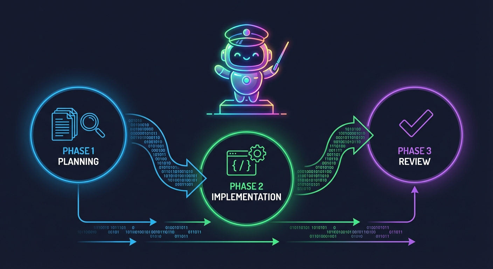
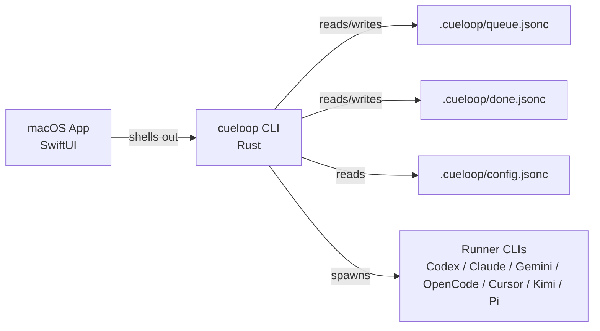

# CueLoop

CueLoop helps developers turn one-off AI coding requests into a local, reviewable task loop: queue the work in repo-local JSONC files, track it through Git when shared mode is used, run it through Codex/Claude/Gemini/Pi-style agents, and require explicit review plus local checks before completion.

[](https://crates.io/crates/cueloop)
[](https://docs.rs/cueloop)
[](https://github.com/fitchmultz/cueloop/releases/tag/v0.6.0)



## What you are seeing

A task starts as repo-local queue data, moves through supervised planning, implementation, and review phases, then is accepted only after CueLoop updates the queue and runs the configured local gate. The important part is not the runner brand; it is that the workflow stays inspectable in your repository instead of disappearing into chat history or hidden SaaS state.

You can inspect the current CLI without configuring an external model runner. Core commands include:

```text
Commands:
  queue     Inspect and manage the task queue
  config    Inspect and manage CueLoop configuration
  run       Run CueLoop supervisor (executes queued tasks)
  task      Create and build tasks from freeform requests
  scan      Scan repository for new tasks and focus areas
  ...

Common first commands:
  cueloop init                         Bootstrap CueLoop in this repo
  cueloop queue list                   See queued work
  cueloop task "Fix the flaky test"    Create a task from a request
  cueloop run one                      Run the next task
  ...
```

## Who this is for

CueLoop is for developers and small teams who already use AI coding agents but need the surrounding workflow to be repeatable:

- evaluators who want a local-first agent orchestration project they can verify quickly
- maintainers who want AI-generated work to move through the same queue, review, and CI path as human work
- agent-heavy teams that want to swap runners without rewriting their repo workflow
- macOS users who want a local app view over the same CLI behavior

## The problem

Ad-hoc AI coding works until the team needs to answer basic delivery questions:

- What work is queued, blocked, running, or done?
- Which agent ran it, with which local checks, and what happened next?
- Can another developer resume the work from files in the repo?
- Can we run more than one task without corrupting the branch?
- Can we change from one agent runner to another without changing the process?

CueLoop’s answer is a plain-file task queue, a supervised runner loop, and local validation gates that remain visible to Git and normal developer tools.

## What CueLoop does

| Problem | Capability | Proof / where to inspect |
| --- | --- | --- |
| AI work gets trapped in chat history | Stores active and completed work in repo-local `.cueloop/queue.jsonc` and `.cueloop/done.jsonc` JSONC files | `cueloop queue list`, `cueloop queue validate`, [Queue docs](docs/features/queue.md) |
| Different agent CLIs have different knobs | Normalizes runner selection across `codex`, `opencode`, `gemini`, `claude`, `cursor`, `kimi`, and `pi` | `cueloop runner list`, [CLI reference](docs/cli.md) |
| “Agent finished” is not enough quality control | Supports one-, two-, and three-phase execution: plan, implement, review/complete | `cueloop run one --phases 3`, [Architecture overview](docs/architecture.md) |
| Local CI and queue state drift out of sync | Runs configured gates before completion and validates queue/done state after runs | `make agent-ci`, [CI strategy](docs/guides/ci-strategy.md) |
| Parallel agent work can damage the base repo | Uses isolated worker workspaces for parallel execution and an integration loop for completed workers | `cueloop run loop --parallel <N>`, [Architecture overview](docs/architecture.md#sequence-parallel-worker-lifecycle) |
| A GUI can become a second source of truth | The SwiftUI macOS app shells out to the same `cueloop` CLI and machine contract | `apps/CueLoopMac/`, [Machine contract](docs/machine-contract.md) |

## Why not just use Codex or Claude Code directly?

CueLoop does not replace agent CLIs. It wraps them in a local task loop: queue, phase, validate, review, and archive work so agent output does not disappear into chat history or hidden SaaS state.

## Fastest way to see it work

### 1. Install the CLI

From crates.io:

```bash
cargo install cueloop
```

From this repository:

```bash
git clone https://github.com/fitchmultz/cueloop cueloop
cd cueloop
make install
# macOS/Homebrew GNU Make users: gmake install
```

### 2. Run the no-runner smoke path

This path verifies the CLI and queue model without first wiring up Codex, Claude, Gemini, or another runner:

```bash
cueloop init
cueloop --help
cueloop queue validate
cueloop queue explain
cueloop run one --help
```

Expected result: CueLoop creates or refreshes `.cueloop/` runtime files, command help is available, and queue commands print the current local task state.

For a reviewer-friendly script, use [docs/guides/local-smoke-test.md](docs/guides/local-smoke-test.md). For a short evaluation route through the repo, use [docs/guides/evaluator-path.md](docs/guides/evaluator-path.md).

### 3. Try one real task loop

After choosing a runner/profile:

```bash
cueloop task "Add retry coverage for webhook delivery failures"
cueloop queue list
cueloop queue show <created-task-id>
cueloop run one --profile safe --phases 3
cueloop queue validate
```

Use the task ID printed by `cueloop task` or `cueloop queue list`. That demonstrates the core loop: request → queue item → supervised agent phases → local validation → queue update.

## How it works

CueLoop centers on an operator-started loop over repository-local tasks.



1. Tasks live in `.cueloop/queue.jsonc`; terminal tasks are archived to `.cueloop/done.jsonc`.
2. A human starts `cueloop run one`, `cueloop run loop`, or `cueloop run loop --parallel <N>`.
3. CueLoop resolves config, selected profile, runner overrides, queue state, and safety checks.
4. The runner executes one, two, or three supervised phases.
5. CueLoop runs the configured local gate before completion and before any configured publish behavior.
6. Queue/done state is validated, archived, and finalized according to config.
7. The macOS app uses the same CLI/machine surfaces rather than a separate workflow engine.

Deeper design notes live in [docs/architecture.md](docs/architecture.md), and command behavior lives in [docs/cli.md](docs/cli.md).

## Current limits and safety posture

- CueLoop is local-first orchestration, not hosted SaaS. Runner CLIs may still send prompts/context to their external services depending on your runner configuration.
- The safe onboarding path avoids automatic git publishing. Higher-blast-radius profiles such as power-user automation are opt-in.
- Parallel execution is available but experimental; use it only when branch policy and workspace isolation are understood.
- macOS UI tests are intentionally outside the default `make macos-ci` gate because they require headed interaction.
- CueLoop does not replace your existing test/build tools; it calls your configured local gate.

Security references: [SECURITY.md](SECURITY.md) and [docs/security-model.md](docs/security-model.md).

## Project map

| Path | Purpose |
| --- | --- |
| `crates/cueloop/` | Primary Rust 2024 crate and `cueloop` executable |
| `crates/cueloop/src/` | CLI, queue, runner, config, migration, plugin, redaction, and support modules |
| `crates/cueloop/tests/` | Rust integration tests and shared test support |
| `apps/CueLoopMac/` | SwiftUI macOS app that delegates behavior to the bundled CLI |
| `docs/` | Product docs, architecture, CLI reference, configuration, security, release, and evaluator guides |
| `schemas/*.schema.json` | Generated JSON schemas; refresh with `make generate` when sources change |
| `.cueloop/` | Repo-local task queue, done archive, config, prompt overrides, and runtime artifacts |
| `Makefile`, `mk/` | Canonical local build, test, release, and verification entrypoints |

## Development and verification

Run commands from the repository root. GNU Make >= 4 is required; on macOS install Homebrew Make and use `gmake` if Apple `make` is first on `PATH`.

```bash
# Required everyday gate for normal changes
make agent-ci

# Fast docs/community gate
make ci-docs

# Full Rust release-shaped gate
make ci

# macOS app gate
make macos-ci

# Final release/platform gate
make release-gate
```

`make agent-ci` routes based on the current local diff. Use [docs/guides/ci-strategy.md](docs/guides/ci-strategy.md) for the full gate map.

## Documentation

Start with:

- [Documentation index](docs/index.md)
- [Evaluator path](docs/guides/evaluator-path.md)
- [Quick start](docs/quick-start.md)
- [Local smoke test](docs/guides/local-smoke-test.md)
- [CLI reference](docs/cli.md)
- [Configuration](docs/configuration.md)
- [Architecture overview](docs/architecture.md)
- [Troubleshooting](docs/troubleshooting.md)
- [Versioning policy](docs/versioning-policy.md)
- [Contributing](CONTRIBUTING.md)
- [Changelog](CHANGELOG.md)

## Versioning and license

CueLoop follows semantic versioning for the product and the `cueloop` crate/package. Breaking CLI or config behavior changes are called out in the changelog and migration notes.

License: MIT.

## Next action

If you are evaluating CueLoop, run the [Evaluator Path](docs/guides/evaluator-path.md). If you are ready to try it in a repo, install the CLI and run the no-runner smoke path above first.
