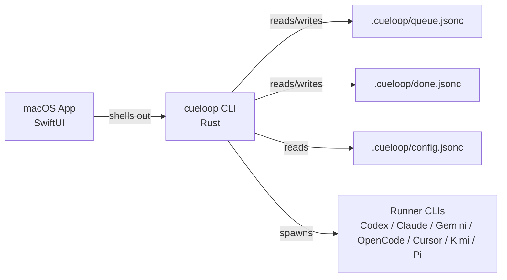

# CueLoop

[](https://crates.io/crates/cueloop-agent-loop)
[](https://docs.rs/cueloop-agent-loop)
[](https://github.com/fitchmultz/ralph/releases)

CueLoop is a local-first AI coding workflow tool with a Rust CLI and a SwiftUI macOS app, both built around a structured task queue stored in your repository.

The primary executable and package are now `cueloop` and `cueloop-agent-loop`. The legacy `ralph` executable remains available as a compatibility alias during the migration window. New repositories use `.cueloop/` for runtime state; legacy `.ralph/` repositories remain supported and can move with `cueloop migrate runtime-dir --apply`.

Teams use CueLoop when ad-hoc AI coding stops being enough and they need a repeatable way to turn requests into queued work, run that work through Codex/Claude/Gemini-style agents, and keep the result reviewable with local files, local CI, and explicit task history instead of hidden SaaS state.

## Reviewer Path

If you are evaluating the repo quickly and want the fastest high-signal path:

1. Read the product overview in this README.
2. Run the no-runner-required verification flow in [docs/guides/local-smoke-test.md](docs/guides/local-smoke-test.md).
3. Skim the command map in [docs/cli.md](docs/cli.md).
4. Use [docs/guides/evaluator-path.md](docs/guides/evaluator-path.md) for a short "what to try, what to expect" walkthrough.

That path is intentionally local-first and does not require configuring Codex/Claude/Gemini before you can validate the repo.

## What CueLoop Is For

CueLoop is designed for engineering teams that want repeatable, auditable AI-assisted development workflows.

It provides:

- A structured task queue with explicit lifecycle and dependency links
- Multi-runner execution (`codex`, `opencode`, `gemini`, `claude`, `cursor`, `kimi`, `pi`)
- Supervised 1/2/3-phase execution (plan, implement, review)
- Parallel execution with workspace isolation
- Guardrails around queue validity, retries, session recovery, and local CI gates

### Non-goals

- Hosted SaaS orchestration (CueLoop is local-first)
- Hidden black-box state (queue and done files are plain JSONC in `.cueloop/`; legacy `.ralph/` remains supported)
- Replacing your existing developer tooling; CueLoop integrates with it

## Core Operating Model

CueLoop centers on an operator-started run loop over repo-local tasks:

1. Tasks live in `.cueloop/queue.jsonc` and completed work is archived to `.cueloop/done.jsonc` by default; legacy `.ralph/queue.jsonc` and `.ralph/done.jsonc` are still read.
2. A human starts `cueloop run one`, `cueloop run loop`, or `cueloop run loop --parallel <N>`.
3. CueLoop invokes the configured runner through supervised one-, two-, or three-phase execution.
4. In three-phase mode, Phase 3 reviews the implementation, resolves issues, and records completion.
5. The configured CI gate runs before task completion and before automatic publish behavior.
6. Post-run supervision validates queue state, archives the task, and commits or pushes according to `git_publish_mode`.
7. Parallel mode applies the same task-sized workflow in isolated worker workspaces, then integrates completed workers back to the target branch.

## Architecture at a Glance



## Install

From crates.io:

```bash
cargo install cueloop-agent-loop
```

This installs the primary `cueloop` executable and the legacy `ralph` compatibility alias.

From source:

> GNU Make >= 4 is required for project targets. On macOS, install via `brew install make` and use `gmake` unless GNU Make is already your default `make`.

```bash
git clone https://github.com/fitchmultz/ralph cueloop
cd cueloop
make install
# macOS/Homebrew GNU Make users: gmake install
```

## Supported Platforms & Toolchain

- Supported OS: macOS and Linux
- Rust toolchain: pinned by `rust-toolchain.toml` (for deterministic fmt/clippy/test behavior)
- SwiftUI app: macOS only (`apps/CueLoopMac/`)

## Quick Start

```bash
# 1) Initialize in your repo
cueloop init

# 2) Inspect the default-safe profile
cueloop config profiles

# 3) Add a task
cueloop task "Stabilize flaky queue integration test"

# 4) Execute one task with the recommended safe profile
cueloop run one --profile safe

# 5) Inspect queue state
cueloop queue list
```

`cueloop init` now defaults to the safe path: non-aggressive approvals, no automatic git publish, parallel execution kept opt-in, and local repo trust created in `.cueloop/trust.jsonc` for current repos (`.ralph/trust.jsonc` remains supported for legacy repos; both are gitignored by init).
Interactive init also lets you choose shared-vs-local queue tracking and opt into additional ignored local files for parallel worker sync; non-interactive init keeps the deterministic `.env*` sync default only.
Use `--profile power-user` only when you explicitly want the higher-blast-radius behavior, including commit_and_push automation.
On macOS, app-launched runs remain noninteractive: the app can supervise and disclose safety posture, but interactive approvals are still terminal-only.

If you do not want to configure a runner yet, use the smoke-test flow instead of `cueloop run one`.
That gives you a deterministic way to verify the CLI and repo health without any external model setup.

## End-to-End Example

Here is a concrete repo workflow for a team using Codex or Claude Code in a normal feature branch:

```bash
# install CueLoop in your application repo
cargo install cueloop-agent-loop
cd your-service
cueloop init

# turn a real request into queued work
cueloop task "Add retry coverage for webhook delivery failures"

# inspect the task CueLoop just created
cueloop queue list
cueloop queue show RQ-0001

# let your configured runner plan, implement, and review the task
cueloop run one --profile safe --phases 3

# verify the repo is still healthy and the task moved forward
cueloop queue list
cueloop doctor
```

What this gives the team: one tracked queue, one explicit task lifecycle, one local verification path, and the flexibility to swap runners without changing the repo workflow.

## Local Smoke Test (5 minutes)

No external runner setup required:

```bash
cueloop init
cueloop --help
cueloop help-all
cueloop run one --help
cueloop scan --help
cueloop queue list
cueloop queue graph
cueloop queue validate
cueloop doctor
make agent-ci
```

Expected signals:

- Help and queue commands succeed
- `cueloop doctor` exits successfully
- `make agent-ci` completes with passing checks for the current dependency surface
- Source snapshots without `.git/` fall back to `make release-gate` (`macos-ci` on macOS with Xcode, otherwise `ci`)

Full scripted version: [docs/guides/local-smoke-test.md](docs/guides/local-smoke-test.md)

## Security & Data Handling

CueLoop is local-first, but selected runner CLIs may transmit prompts/context to external APIs depending on your runner configuration.

- Do not place secrets in task text, notes, or tracked config
- Keep runtime artifacts local (`.cueloop/cache/`, `.cueloop/logs/`, `.cueloop/workspaces/`, `.cueloop/undo/`, `.cueloop/webhooks/`; legacy `.ralph/` paths remain supported)
- Use `make pre-public-check` before public release windows

Security references:

- [SECURITY.md](SECURITY.md)
- [Security Model](docs/security-model.md)

## Known Limitations

- Quality/speed depend on selected runner model and prompts
- UI tests are intentionally not part of default `make macos-ci` (headed interaction)
- Parallel execution is experimental and introduces additional branch/workspace complexity in very large repos

## Versioning & Compatibility

CueLoop follows semantic versioning for the product and the `cueloop-agent-loop` crate/package.

- Minor/patch releases preserve existing behavior unless explicitly documented
- Breaking CLI/config behavior changes are called out in changelog and migration notes

Details: [docs/versioning-policy.md](docs/versioning-policy.md)

## Documentation

Start here:

- [Documentation Index](docs/index.md)
- [Evaluator Path](docs/guides/evaluator-path.md)
- [Architecture Overview](docs/architecture.md)
- [Quick Start](docs/quick-start.md)
- [Local Smoke Test](docs/guides/local-smoke-test.md)
- [CLI Reference](docs/cli.md)
- [Configuration](docs/configuration.md)
- [Project Operating Constitution](docs/guides/project-operating-constitution.md)
- [Decisions](docs/decisions.md)
- [Troubleshooting](docs/troubleshooting.md)
- [CI and Test Strategy](docs/guides/ci-strategy.md)
- [Public Readiness Checklist](docs/guides/public-readiness.md)

Policies:

- [CONTRIBUTING.md](CONTRIBUTING.md)
- [CODE_OF_CONDUCT.md](CODE_OF_CONDUCT.md)
- [SECURITY.md](SECURITY.md)
- [CHANGELOG.md](CHANGELOG.md)

## Repository Runtime State

This repository may keep small sanitized runtime state for reproducible examples and documentation.
In most consumer repositories, `.cueloop/` is project-local runtime state managed by `cueloop init`, including the generated `.cueloop/README.md` guidance file that is intended for agents and operators. Legacy `.ralph/` state is still supported; use `cueloop migrate runtime-dir --apply` when ready to move it.

## Development

```bash
# Required everyday gate
make agent-ci

# Heaviest final gate before release/publication
make release-gate

# Public-readiness audit
make pre-public-check
```

`make agent-ci` is the command most contributors and agents should use by default. The lower-level targets (`ci-docs`, `ci-fast`, `ci`, `macos-ci`) still exist, but they are mainly the implementation details behind that router and explicit power-user escape hatches.

## License

MIT
