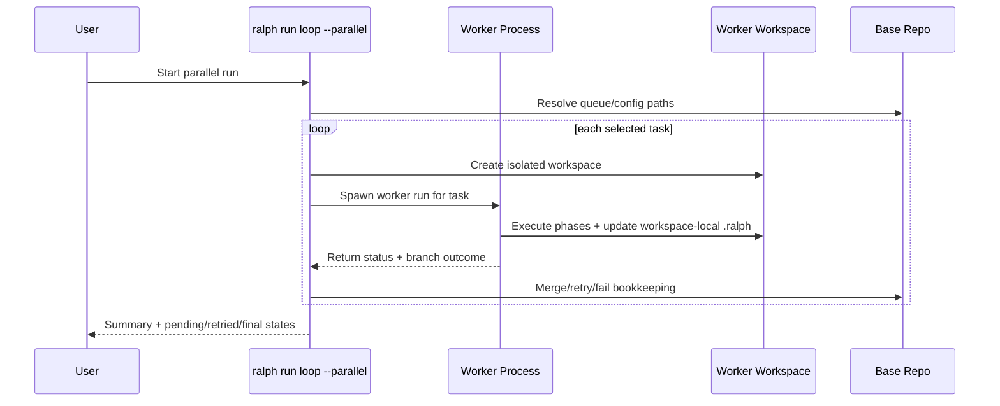
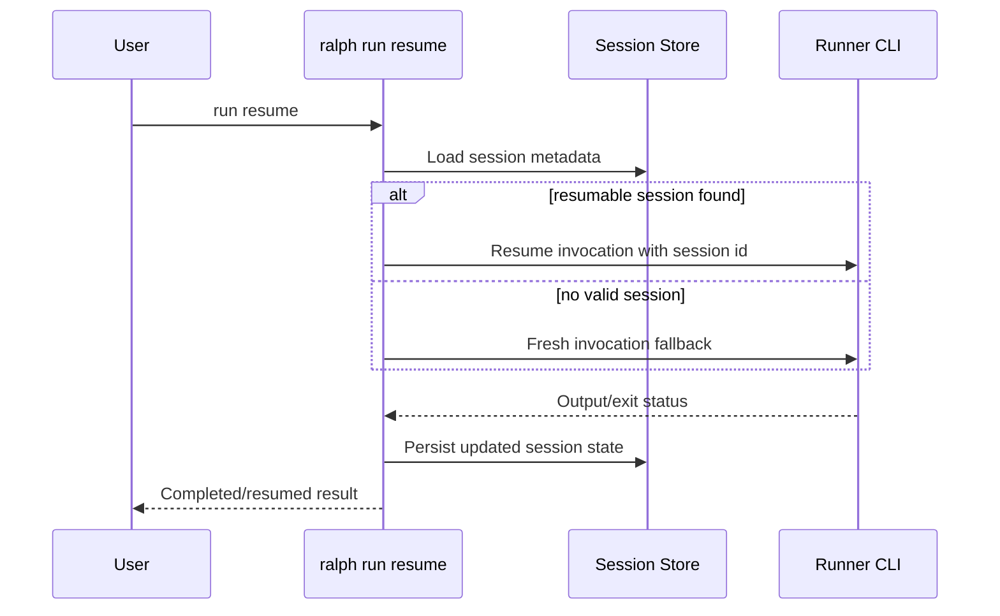

# Architecture Overview

Purpose: describe Ralph’s components, runtime data flow, trust boundaries, and failure handling model.

## System Boundary

Ralph is a local-first orchestration system for AI-assisted engineering workflows.

- Primary runtime: Rust CLI (`crates/ralph/`)
- Optional UI: SwiftUI macOS app (`apps/RalphMac/`) that shells out to the same CLI binary
- State store: repo-local `.ralph/` files (`queue.jsonc`, `done.jsonc`, optional `config.jsonc`)
- External dependencies: runner CLIs (Codex/Claude/Gemini/OpenCode/Cursor/Kimi/Pi), git, optional GitHub CLI

## Core Components

### 1) Queue + Task Lifecycle

- Task state is explicit (`todo`, `doing`, `done`, `rejected`, etc.)
- Queue operations (validate, sort, archive, search, graph/tree) live in `crates/ralph/src/queue/` and command modules

### 2) Run Supervision Engine

- `crates/ralph/src/commands/run/` orchestrates plan/implement/review phases
- Supports `run one`, `run loop`, resume/recovery, and parallel worker execution
- Applies CI gating and failure handling to keep repository state coherent

### 3) Runner Integration Layer

- Runner-specific flags/settings are normalized through contracts + config resolution
- Phase-level runner/model/effort overrides allow controlled execution behavior

### 4) Safety and Reliability Layers

- Startup sanity checks (`crates/ralph/src/sanity/`)
- Locking and concurrency controls (`crates/ralph/src/lock.rs`)
- Redaction and output safety (`crates/ralph/src/redaction.rs`)

### 5) macOS App Bridge

- App UI focuses on queue visibility and workflow ergonomics
- `RalphCLIClient` bridges app actions to CLI commands to preserve behavior parity

## Trust Boundaries

Boundary 1: Local repository and `.ralph/` state

- Trusted for local persistence and auditability
- Must remain schema-valid and lock-protected during concurrent operations

Boundary 2: Runner subprocesses

- Runner CLIs are external programs and may transmit prompts/context to external APIs
- Ralph treats runner output as untrusted input and normalizes/parses before state transitions

Boundary 3: Git / shell tooling

- External commands can fail or return partial output
- Ralph wraps command execution with explicit error handling and retry/resume paths

## Data and Control Flow

Typical `run one` flow:

1. User invokes CLI (or app delegates to CLI)
2. Config is resolved (CLI flags → project config → global config → defaults)
3. Sanity checks run (unless explicitly disabled)
4. Supervision engine selects task/phase and invokes runner subprocess(es)
5. Queue transitions and output artifacts are persisted
6. Optional CI gate and final checks run before completion

Parallel mode adds per-worker workspaces and coordinator-controlled merge/retry behavior.

## Sequence: Parallel Worker Lifecycle

## Sequence: Session Resume Recovery

## Failure Modes and Recovery

- Runner exits with transient failure or signal:
  - Recovery: bounded resume attempts, then terminal failure handling
- Invalid/missing resume session:
  - Recovery: fallback to fresh invocation for supported runner error signatures
- Queue state drift or malformed terminal timestamps:
  - Recovery: conservative maintenance + validation; malformed timestamps remain hard failures
- Parallel worker leaves dirty bookkeeping files:
  - Recovery: fail fast before merge/rebase; enforce workspace-local restore invariants

## Key Design Decisions and Trade-offs

Local-first JSONC state:

- Pros: diffable, auditable, easy backup/recovery
- Trade-off: needs strict validation/repair logic

Multi-phase supervised execution:

- Pros: explicit quality/speed controls
- Trade-off: orchestration complexity (resume/retry edge cases)

Thin macOS app over CLI parity:

- Pros: one behavior source of truth
- Trade-off: UX depends on robust CLI bridge behavior

Local-CI-first workflow:

- Pros: deterministic local verification without remote CI dependence
- Trade-off: strong scripts/docs required for onboarding consistency

## Operational Expectations

- Use `make agent-ci` for routine PR-equivalent checks
- Use `make ci` for full Rust release gate
- Use `make macos-ci` when app changes are in scope
- Use `make pre-public-check` before public release windows
