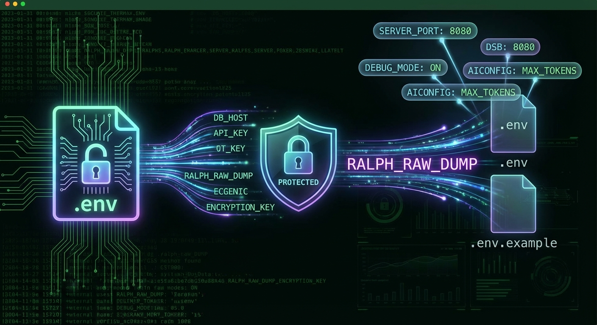

# Environment Variables
Status: Active
Owner: Maintainers
Source of truth: this document for its stated scope
Parent: [CueLoop Documentation](index.md)




Purpose: List environment variables recognized by CueLoop and how they affect behavior.

## .env Files

> **Security Note:** `.env` files should NOT be committed to public repositories. They may contain secrets or sensitive configuration. This repo uses `.env.example` as the canonical template—copy it to `.env` and customize locally.

- `.env`: project-local environment configuration (ignored by git; never commit to public repos).
- `.env.example`: canonical template for new environments (committed; safe to share).

## Variables

- `CUELOOP_RAW_DUMP`: `1` or `true`. Opt-in to raw (non-redacted) safeguard dumps when set to `1` or `true`. This is the only raw-dump environment variable.

  **Security Warning**: Raw dumps may contain secrets (API keys, tokens, credentials). Only enable when necessary for debugging. Prefer redacted dumps (the default) for sharing error reports.

  Example:

  ```bash
  CUELOOP_RAW_DUMP=1 cueloop run one
  ```

## Examples

```bash
# Enable raw safeguard dumps (use with caution)
CUELOOP_RAW_DUMP=1
```
