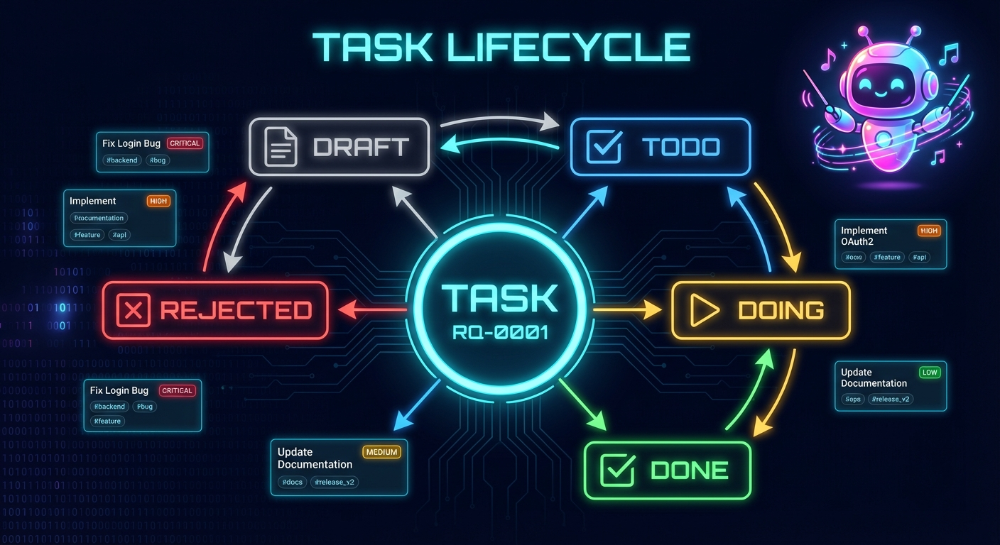

# CueLoop Task System
Status: Active
Owner: Maintainers
Source of truth: this document for task-system navigation and documentation ownership
Parent: [Feature Documentation](README.md)

The Task System is the core unit of work in CueLoop. Tasks represent discrete pieces of work with metadata, relationships, lifecycle state, and execution configuration.

Use this page as the task-system index. Detailed guidance lives in focused child pages so schema, lifecycle, relationship, and operator workflows can evolve without one oversized mixed-scope document.

---

## Task Documentation Map

| Need | Canonical page |
|------|----------------|
| Task JSON shape, fields, queue-file basics, per-task agent overrides, validation, and complete examples | [Task Schema and Field Reference](task-schema.md) |
| Status values, lifecycle timestamps, transition behavior, and priority semantics | [Task Lifecycle and Priority](task-lifecycle.md) |
| `depends_on`, `blocks`, `relates_to`, `duplicates`, `parent_id`, and relationship validation | [Task Relationships](task-relationships.md) |
| Creating, editing, templating, cloning, importing, batching, and quick CLI workflows | [Task Operations](task-operations.md) |

---

## Overview

A **Task** in CueLoop is a JSON object representing a discrete unit of work. Tasks are stored in `.cueloop/queue.jsonc` for active work and `.cueloop/done.jsonc` for completed or rejected work.

Tasks capture identity, state, context, relationships, and execution configuration. They are the interface between operators and AI agents: they preserve the original request, guide execution, track progress, and support recovery.

For queue file operations and archive mechanics, see [Queue](queue.md). For the older combined reference, see [Queue and Tasks](../queue-and-tasks.md).

---

## Task Fields

Moved to [Task Schema and Field Reference](task-schema.md#task-fields). That page owns required fields, optional fields, scheduling fields, custom fields, and compact schema references for relationship and agent override fields.

## Task Status Lifecycle

Moved to [Task Lifecycle and Priority](task-lifecycle.md#task-status-lifecycle). That page owns status values, transition rules, timestamp behavior, and implementation notes.

## Task Priority

Moved to [Task Lifecycle and Priority](task-lifecycle.md#task-priority). That page owns priority levels, ordering, cycling behavior, and execution effects.

## Task Relationships

Moved to [Task Relationships](task-relationships.md#task-relationships). That page owns dependency, blocking, related-task, duplicate, and parent/child hierarchy semantics.

## Per-Task Agent Configuration

Moved to [Task Schema and Field Reference](task-schema.md#per-task-agent-configuration). That page owns agent override fields, configuration precedence, runner CLI overrides, and override behavior notes.

## Task Creation

Moved to [Task Operations](task-operations.md#task-creation). That page owns direct creation, task builder, templates, refactor scans, imports, clone workflows, and app entry points.

## Task Editing

Moved to [Task Operations](task-operations.md#task-editing). That page owns edit commands, editable field formats, custom fields, AI-powered update, and batch operations.

## Task Templates

Moved to [Task Operations](task-operations.md#task-templates). That page owns template structure, variable substitution, locations, and custom template examples.

## Task Validation

Moved to [Task Schema and Field Reference](task-schema.md#task-validation). Relationship-specific validation guidance is also summarized in [Task Relationships](task-relationships.md#relationship-validation-summary).

## Complete Task Examples

Moved to [Task Schema and Field Reference](task-schema.md#complete-task-examples). That page owns valid JSON examples for basic tasks, dependencies, agent overrides, hierarchy, and custom fields.

## CLI Quick Reference

Moved to [Task Operations](task-operations.md#cli-quick-reference). That page owns quick operator command examples.

## See Also

- [Task Schema and Field Reference](task-schema.md) — task JSON fields and validation.
- [Task Lifecycle and Priority](task-lifecycle.md) — status and priority semantics.
- [Task Relationships](task-relationships.md) — relationship fields and validation.
- [Task Operations](task-operations.md) — creation, editing, templates, and CLI workflows.
- [Queue](queue.md) — queue operations, locking, repair, archive, import/export.
- [Dependencies](dependencies.md) — graph execution, dependency analysis, and critical paths.
- [Configuration](../configuration.md) — global and project configuration.
- [CLI](../cli.md) — complete CLI reference.
