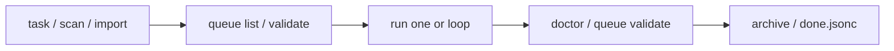

# Getting started

Status: Active  
Owner: Maintainers  
Source of truth: guided onboarding beyond the quick start  
Parent: [Documentation index](../index.md)

This guide extends [Quick start](../quick-start.md) with init details, runner choice, and a typical daily loop. For the shortest path, read quick start first, then return here for wizard behavior and habits.

## Prerequisites

- Rust toolchain (to install from crates.io: `cargo install cueloop`)
- A git repository where you want task state
- Optional: a configured AI runner CLI (Codex, Claude, Gemini, OpenCode, Cursor, Kimi, or Pi)

Verify install:

```bash
cueloop version
```

## Initialize a project

```bash
cd your-project
cueloop init
```

`cueloop init` writes `.cueloop/config.jsonc` with safe defaults, creates or refreshes queue/done files, and (for current repos) adds gitignored `.cueloop/trust.jsonc` so local execution can work without committing machine trust.

### Interactive wizard (TTY)

When stdin is a terminal, the wizard walks through:

1. Runner selection  
2. Model selection for that runner  
3. Workflow mode: 1-, 2-, or 3-phase  
4. Whether `.cueloop/` queue state is tracked in git or kept local-only  
5. Optional extra ignored files for parallel worker sync (`.env` / `.env.*` are already included)  
6. Optional first task  

### Non-interactive / CI

```bash
cueloop init --non-interactive
```

Uses defaults without prompts. Re-run with `cueloop init --force` only when you intend to overwrite existing CueLoop files.

See [Configuration](../configuration.md) and [Trust and precedence](../configuration/trust-and-precedence.md) for trust, git tracking, and parallel sync details.

## Create and inspect tasks

```bash
cueloop task "Add regression tests for queue repair"
cueloop queue list
cueloop queue show <task-id>
cueloop queue validate
```

Decompose a large goal into a previewed task tree (preview is default; `--write` persists):

```bash
cueloop task decompose "Build OAuth login with GitHub and Google"
cueloop task decompose "Build OAuth login with GitHub and Google" --write
```

Task model reference: [Tasks](../features/tasks.md), [Task schema](../features/task-schema.md).

## Run work

```bash
# Next runnable task
cueloop run one

# Explicit three-phase supervision
cueloop run one --phases 3

# Capped loop
cueloop run loop --max-tasks 3
```

Before configuring a runner, use dry-run and the [local smoke test](local-smoke-test.md) instead of a real agent pass:

```bash
cueloop run one --dry-run
```

Readiness:

```bash
cueloop doctor
cueloop queue next --with-title
```

Execution details: [Phases](../features/phases.md), [Runners](../features/runners.md), [Supervision](../features/supervision.md).

## macOS app

The SwiftUI app shells out to the same CLI and machine contract — it is not a second workflow engine.

```bash
cueloop app open
```

See [App](../features/app.md) and [Machine contract](../machine-contract.md).

## Configuration essentials

- Hub: [Configuration](../configuration.md)  
- Profiles: [Profiles](../features/profiles.md)  
- Prompt overrides: `.cueloop/prompts/` — [Prompts](../features/prompts.md)  
- CI gate for this repo: `make agent-ci` — [CI strategy](ci-strategy.md)  

## Daily loop



Typical commands:

```bash
cueloop queue list
cueloop run one --profile safe
cueloop queue validate
```

For parallel execution (experimental): [Parallel](../features/parallel.md). For background automation: [Daemon and watch](../features/daemon-and-watch.md).

## Next steps

| Goal | Document |
| --- | --- |
| Command reference | [CLI reference](../cli.md) |
| Power-user workflows | [Advanced usage](advanced.md) |
| Evaluation / review | [Evaluator path](evaluator-path.md) |
| End-to-end fixture run | [Dogfood harness](dogfood-cueloop.md) |
| Problems | [Troubleshooting](../troubleshooting.md) |
| Contributing | [CONTRIBUTING](../../CONTRIBUTING.md) |
