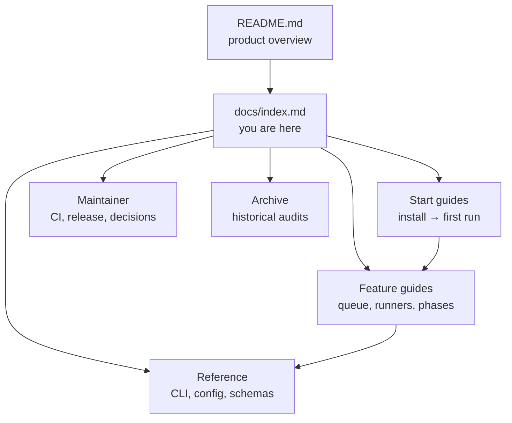

# CueLoop documentation

Status: Active  
Owner: Maintainers  
Source of truth: navigation hub for `docs/`  
Parent: [README](../README.md)

CueLoop is a Rust CLI (and optional macOS app) for queue-driven, auditable AI coding agent work. State lives in repo-local `.cueloop/` files so tasks can be inspected, diffed, resumed, and gated with your own commands.

## How to read these docs



| If you want to… | Start here |
| --- | --- |
| Decide whether CueLoop fits your workflow | [README](../README.md) → [Evaluator path](guides/evaluator-path.md) |
| Install and run the first command | [Quick start](quick-start.md) |
| Walk through init, runners, and daily use | [Getting started](guides/getting-started.md) |
| Look up a command or flag | [CLI reference](cli.md) |
| Change behavior or runners | [Configuration](configuration.md) |
| Understand queue files and task fields | [Tasks](features/tasks.md) → [Task schema](features/task-schema.md), [Queue](features/queue.md) |
| Debug a failed run | [Troubleshooting](troubleshooting.md) |
| Contribute or change the repo | [CONTRIBUTING](../CONTRIBUTING.md) → [CI strategy](guides/ci-strategy.md) |

## Start here

Onboarding and verification (read in this order when evaluating the project):

1. [README](../README.md) — problem, capabilities, and a no-runner smoke path  
2. [Evaluator path](guides/evaluator-path.md) — shortest reviewer-friendly path  
3. [Quick start](quick-start.md) — install, `init`, create a task, run one  
4. [Local smoke test](guides/local-smoke-test.md) — scripted install/queue checks without a runner  
5. [Getting started](guides/getting-started.md) — longer guided path (init wizard, runners, daily loop)

Optional next steps:

- [CueLoop dogfood harness](guides/dogfood-cueloop.md) — fixture repo with real three-phase execution  
- [Agent usage guide](guides/agent-usage.md) — using CueLoop as a ledger from an already-running coding agent  
- [Architecture overview](architecture.md) — components, trust boundaries, data flow  

## Core concepts

| Topic | Document |
| --- | --- |
| Three-phase execution | [Phases](features/phases.md) |
| Queue files and operations | [Queue](features/queue.md) |
| Task model (index) | [Tasks](features/tasks.md) |
| Task fields and schema | [Task schema](features/task-schema.md) |
| Status lifecycle | [Task lifecycle](features/task-lifecycle.md) |
| Dependencies and relationships | [Dependencies](features/dependencies.md), [Task relationships](features/task-relationships.md) |
| Runners | [Runners](features/runners.md) |
| Parallel workers | [Parallel](features/parallel.md) |
| Supervision and CI gates | [Supervision](features/supervision.md) |

Legacy combined references (thin hubs — prefer the links above):

- [Queue and tasks](queue-and-tasks.md)  
- [Workflow](workflow.md)  

## Feature guides

Full index: [features/README.md](features/README.md).

| Area | Guides |
| --- | --- |
| Execution | [Phases](features/phases.md), [Runners](features/runners.md), [Parallel](features/parallel.md), [Session management](features/session-management.md), [Supervision](features/supervision.md) |
| Automation | [Daemon and watch](features/daemon-and-watch.md), [Scan](features/scan.md), [Webhooks](features/webhooks.md), [Notifications](features/notifications.md) |
| Extensibility | [Plugins](features/plugins.md), [Plugin development](plugin-development.md), [Prompts](features/prompts.md), [Profiles](features/profiles.md) |
| Data | [Import/export](features/import-export.md), [Migrations](features/migrations.md) |
| macOS app | [App](features/app.md), [Machine contract](machine-contract.md) |
| Security | [Security features](features/security.md), [Security model](security-model.md), [SECURITY.md](../SECURITY.md) |

## Reference

| Document | Contents |
| --- | --- |
| [CLI reference](cli.md) | Commands, flags, common workflows |
| [Configuration](configuration.md) | Config hub and deep dives under `configuration/` |
| [Machine contract](machine-contract.md) | Versioned JSON API for app and automation |
| [Environment](environment.md) | Environment variables |
| [Error handling](error-handling.md) | Failure patterns |
| [Schemas](../schemas/) | Generated JSON schemas (`make generate`) |
| [Versioning policy](versioning-policy.md) | Semver and breaking-change expectations |
| [Support policy](support-policy.md) | Support expectations |

Configuration deep dives:

- [Agent and runners](configuration/agent-and-runners.md)  
- [Queue and parallel](configuration/queue-and-parallel.md)  
- [Trust and precedence](configuration/trust-and-precedence.md)  
- [Notifications and webhooks](configuration/notifications-and-webhooks.md)  
- [Plugins and profiles](configuration/plugins-and-profiles.md)  
- [Migration notes](configuration/migration-notes.md)  

## Operations and quality

| Document | Contents |
| --- | --- |
| [CI and test strategy](guides/ci-strategy.md) | `make agent-ci`, tiers, routing |
| [Troubleshooting](troubleshooting.md) | Common failures |
| [Advanced usage](guides/advanced.md) | Hub for power-user guides |
| [Public readiness](guides/public-readiness.md) | Pre-release checklist |
| [Project operating constitution](guides/project-operating-constitution.md) | Maintainer rules (compact) |

Default validation from the repo root (GNU Make ≥ 4):

```bash
make agent-ci
```

Release-shaped gate: `make release-gate`. Routing uses only the **current uncommitted** diff; see [CI strategy](guides/ci-strategy.md#agent-ci-classifier-path-list) for debugging (`scripts/agent-ci-surface.sh --target`).

## Maintainer

| Document | Contents |
| --- | --- |
| [Decisions](decisions.md) | Decision log |
| [Roadmap archive](roadmap.md) | Historical follow-ups (not active roadmap) |
| [Release runbook](guides/release-runbook.md) | Release steps |
| [Releasing](releasing.md) | Full release guide |
| [Stack audit (2026-04)](guides/stack-audit-2026-04.md) | Toolchain baseline |
| [Releasing / security](releasing.md), [SECURITY.md](../SECURITY.md) | Ship and vulnerability reporting |

Product requirements:

- [Task decompose PRD](prd/cueloop-task-decompose.md)  

Agent-only repo guidance: [AGENTS.md](../AGENTS.md) (not duplicated here).

## Runtime paths (defaults)

| Path | Role |
| --- | --- |
| `.cueloop/queue.jsonc` | Active tasks |
| `.cueloop/done.jsonc` | Completed / rejected archive |
| `.cueloop/config.jsonc` | Project configuration |
| `.cueloop/prompts/*.md` | Prompt overrides (defaults embedded in CLI) |

Before migrating old runtime layouts: `cueloop migrate runtime-dir --check`.

## Archive

Historical audits and superseded notes: [archive/README.md](archive/README.md).
