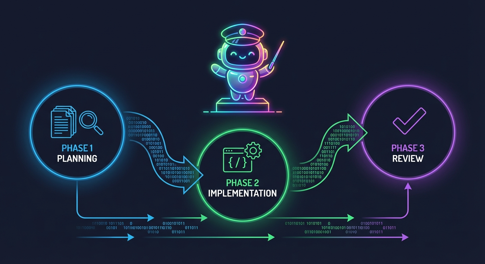

# Operator Workflow Overview
Status: Legacy navigation bridge
Owner: Maintainers
Source of truth: canonical pages linked below
Parent: [CueLoop Documentation](index.md)

This URL is kept for older links and search results. It is no longer the architecture or feature reference for CueLoop runtime behavior.

CueLoop's workflow is a human-started loop over repo-local task files: create or import tasks, inspect the queue, run one or more tasks through supervised phases, validate locally, and archive terminal work.

## Workflow in one page

1. Initialize a repo with `cueloop init`.
2. Add work with `cueloop task "..."`, imports, scans, or the macOS app.
3. Inspect active work with `cueloop queue list`, `cueloop queue next`, and `cueloop queue validate`.
4. Run work with `cueloop run one`, `cueloop run loop --max-tasks <N>`, or `cueloop run loop --parallel <N>`.
5. CueLoop coordinates runner phases, local gates, queue updates, and optional app/automation surfaces.
6. Completed or rejected work moves from `.cueloop/queue.jsonc` to `.cueloop/done.jsonc`.

## Canonical workflow docs

| Need | Canonical page |
| --- | --- |
| Install/init/first local checks | [Quick Start](quick-start.md) |
| Runtime architecture and data flow | [Architecture Overview](architecture.md) |
| Multi-phase execution | [Phases](features/phases.md) |
| Runner orchestration and runner-specific setup | [Runners](features/runners.md) |
| CI gates, git operations, and human review points | [Supervision](features/supervision.md) |
| Queue operations and archive behavior | [Queue](features/queue.md) |
| Task model and task reference map | [Task System](features/tasks.md) |
| Prompt overrides | [Prompts](features/prompts.md) |
| Session recovery and resume behavior | [Session Management](features/session-management.md) |
| Parallel execution | [Parallel](features/parallel.md) |
| Continuous/background operation | [Daemon and Watch](features/daemon-and-watch.md) |
| Webhooks and notifications | [Webhooks](features/webhooks.md), [Notifications](features/notifications.md) |
| Security and redaction | [Security Model](security-model.md), [Security Features](features/security.md) |
| Complete command syntax | [CLI Reference](cli.md) |

## Runtime Files

- `.cueloop/queue.jsonc`: active task queue.
- `.cueloop/done.jsonc`: archive of completed/rejected tasks.
- `.cueloop/config.jsonc`: project-level configuration.
- `.cueloop/prompts/*.md`: optional prompt overrides.
- `.cueloop/cache/`: plans, completions, parallel state, backups, and other runtime artifacts.

## Legacy deep links

The old workflow page exposed broad runtime sections. These headings remain as lightweight redirects so existing deep links continue to land on useful current docs.

## Workflow and Architecture

Moved to [Architecture Overview](architecture.md), [Phases](features/phases.md), and [Supervision](features/supervision.md).

## Prompt Overrides

Moved to [Prompts](features/prompts.md).

## Three-Phase Workflow

Moved to [Phases](features/phases.md) and [Supervision](features/supervision.md).

## Parallel Run Loop (CLI Only)

Moved to [Parallel](features/parallel.md).

## Wait When Blocked (Sequential Loop)

Moved to [Daemon and Watch](features/daemon-and-watch.md), [Daemon/Watch Operations](features/daemon-watch/operations.md), and [CLI Reference](cli.md).

### Queue Unblocked Webhook Event

Moved to [Webhooks](features/webhooks.md) and [Notifications](features/notifications.md).

## Continuous Mode (Sequential Loop)

Moved to [Daemon and Watch](features/daemon-and-watch.md) and [Daemon](features/daemon-watch/daemon.md).

### Daemon Mode

Moved to [Daemon](features/daemon-watch/daemon.md).

### Start Daemon

Moved to [Daemon](features/daemon-watch/daemon.md).

### Check Status

Moved to [Daemon](features/daemon-watch/daemon.md).

### View Logs

Moved to [Daemon](features/daemon-watch/daemon.md).

## Security and Redaction

Moved to [Security Model](security-model.md) and [Security Features](features/security.md).

### Safeguard Dumps

Moved to [Security Features](features/security.md).

### Debug Logging

Moved to [Security Features](features/security.md) and [Troubleshooting](troubleshooting.md).

## Runner Model Control

Moved to [Runners](features/runners.md), [Agent and Runner Configuration](features/configuration-agent.md), and [Configuration](configuration.md).

### Phase 2 Continue (CI Failure Retry)

Moved to [Phases](features/phases.md), [Supervision](features/supervision.md), and [Session Management](features/session-management.md).

## Session State

Moved to [Session Management](features/session-management.md).

## Webhook Events

Moved to [Webhooks](features/webhooks.md).

### Event Types

Moved to [Webhooks](features/webhooks.md).

### Opt-in Behavior

Moved to [Webhooks](features/webhooks.md) and [Notifications](features/notifications.md).

### Runner Session Handling (Kimi)

Moved to [Runners](features/runners.md) and [Session Management](features/session-management.md).

## Maintainer note

Keep this page as a short human orientation bridge. Do not add detailed behavior here; update the canonical feature page instead.
